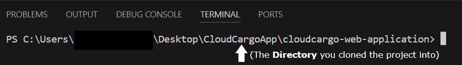

<h1 align="center" style="font-size: 48px;">The Cloud Cargo App</h1>

  

### **Hey there! You have just stumbled upon a pretty ambitious project, so bear with me for a second :))**

This web application is part of a larger project that utilizes **drones to deliver essential supplies during rescue operations.** You can **learn more** about that [here](https://www.instagram.com/p/C9ksqlWsc1P/?igsh=MTBkemp3Nmc3dWJrZQ==);  

The application is designed to provide **a straightforward and user-friendly interface for monitoring and managing drones.**

## Key Features:

1.  **`User Authentication:`**
    
    -   **Login Page:** A simple login page allows users to **securely access the system.**
2.  **`Main Dashboard:`**
    
    -   **Drone Tracking Map:** The **main page** features an **interactive map** that **visually represents the locations of drones using pins.** Users can quickly see where each drone is deployed.
    -   **Drone List with Management Options:** Alongside the **map**, users have access to **a list of all drones.** This list includes essential details like **drone ID and current status**, and features dropdown menus for further information.
3.  **`Drone Management:`**
    
    -   **Basic Operations:** Users can **add new drones** to the system by providing necessary details, and **remove drones** when they are no longer in use. **Admins** can also opt to **refuel** the drones.

### `Technical Implementation:`

-   **The frontend** is built using standard web technologies, including **HTML, CSS, and JavaScript,** and might leverage frameworks like **React** for better component management.
- **The backend** is being designed to handle basic **API requests**, managing drone data efficiently to support the app's functionality.
-  The overall design is **minimalist** and focused on **core functionalities** to ensure ease of use and maintainability.

## Prerequisites

### `Install git`

 - **Windows:**  [https://git-scm.com/download/win](https://git-scm.com/download/win)
 - **macOs:** [https://git-scm.com/download/mac](https://git-scm.com/download/mac)

    
### `Install VSC as IDE`
 - **Windows, macOs:** [https://code.visualstudio.com/](https://code.visualstudio.com/)
    
### `Install Node`
- **Windows, macOs:** https://nodejs.org/en/download/package-manager

## Setup steps
*(In Integrated Terminal)*
1.  **`git clone:`** [https://github.com/cloudcargo2024/cloudcargo-web-application.git](https://github.com/cloudcargo2024/cloudcargo-web-application.git)
    
2.  **`npm install`**
	> Note: **You may experience some issues**. Here are some common fixes:
	- **Make sure that you are in the right directory** (for error code **ENOENT**)
	
	- **Try `npm install --legacy-peer-deps`** (for error code **ERESOLVE**)
     
3.   **`npm start`**

### You should be set now!

## Useful Links 
- [**Git cheat sheet**](https://www.atlassian.com/git/tutorials/atlassian-git-cheatsheet) 
- [**Git game**](https://learngitbranching.js.org/)
- [**FE roadmap**](https://roadmap.sh/frontend)
- [**React Docs**](https://react.dev/learn) *(functional components and typescript)*
- [**FlexBox game**](https://flexboxfroggy.com)
- [**Postman**](https://www.postman.com/)
- [**Http methods**](https://www.w3schools.com/tags/ref_httpmethods.asp)
- [**Http response codes**](https://developer.mozilla.org/en-US/docs/Web/HTTP/Status)
- [**Create your own apis**](https://beeceptor.com/docs/sample-api-for-testing/)